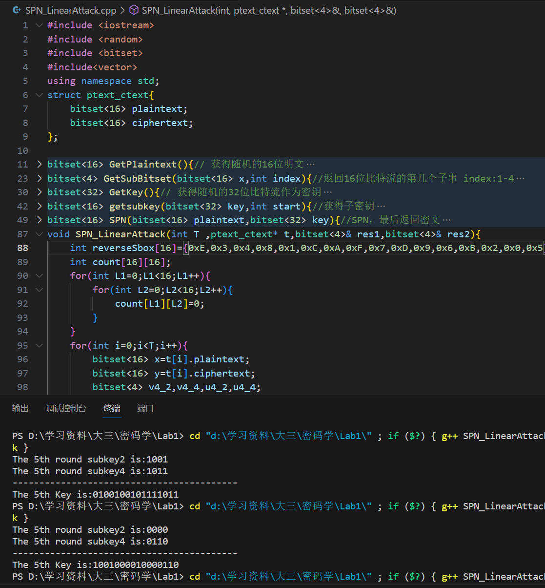

## <center> SPN线性攻击实验报告</center>
##### <center>学号：2113946 刘国民</center>
##### <center>专业：信息安全</center>

   
### 实验目的
利用线性攻击的方法，得到代换-置换网络的部分密钥，减小密钥穷举空间。

### 实验原理
线性攻击是一种针对密码系统的攻击技术。常用于对抗块密码。其核心思想是找到明文、密文和密钥之间的线性关系，使得攻击者可以利用这些关系来推断密钥，而无需进行全密钥空间的穷举搜索。

线性攻击基本思想：

* 线性逼近：攻击者试图找到明文、密文和部分密钥之间的线性表达式，这个表达式与实际的密码关系存在一定的偏差。这种逼近是基于密码系统的非线性组件（如S盒）的已知线性特性来得到的。

* 最大偏差：理想情况下，所选择的线性逼近与实际的密码操作之间的关系是随机的，即关系成立的概率为0.5。但是，由于密码系统的非完美性，存在一些线性逼近的关系成立的概率与0.5存在显著偏差，这种偏差为线性攻击提供了工作的基础。

* 大量明密文对：攻击者需要大量的明文-密文对来估计所选择的线性逼近的真实偏差。根据这个偏差，攻击者可以确定部分密钥的某些位。

* 密钥假设：攻击者会假设部分密钥的值，并验证这个假设是否与从明文-密文对中观察到的偏差一致。如果一致，这部分的密钥假设很可能是正确的。

* 密钥恢复：结合所有的部分密钥假设，从中恢复完整的密钥。


### 代码实现
本次实验使用C++中的`<bitset>`标准库，用于表示SPN加密和线性攻击中的比特流。需要注意的是bitset按照从右往左的方式进行索引，代码实现分为以下几个部分：

#### 明密文对
```C++
struct ptext_ctext{
    bitset<16> plaintext;
    bitset<16> ciphertext;
};
```
用于保存随机生成的大量明文以及密文对。

#### 获取子串
```C++
bitset<4> GetSubBitset(bitset<16> x,int index){//返回16位比特流的第几个子串 index:1-4
    bitset<4> res;
    for(int i=3;i>=0;i--){
            res[i]=x[16-index*4+i];
    }
    return res;
}
```
该函数传入16位比特流和下标`index`，将16位比特流分为4组，每一组4个比特，最后返回第index个子串，通过一个循环实现即可。

#### 获取子密钥
``` C++
bitset<16> getsubkey(bitset<32> key,int start){//获得子密钥
    bitset<16> subkey;
    for(int i=15;i>=0;i--){
        subkey[i]=key[i+16-start];
    }
    return subkey;
}
```
该函数从32位密钥中，获取第`start`位开始的十六位密钥，在密钥编排算法中调用该函数，通过循环实现即可。

#### 获取明文
```C++
bitset<16> GetPlaintext(){// 获得随机的16位明文
    // 使用random_device来为mt19937引擎种子
    random_device rd;
    mt19937 engine(rd());
    // 使用均匀分布来生成0或1的随机比特
    uniform_int_distribution<int> dist(0, 1);
    bitset<16> Plaintext;
    for (int i = 0; i < 16; ++i) {
        Plaintext[i] = dist(engine);
    }
    return Plaintext;
}
```
该函数用于获取随机的16位明文串，使用均匀分布来生成随机的0-1比特流，最后返回获取的16位明文。
#### 获取密钥
```C++
bitset<32> GetKey(){// 获得随机的32位比特流作为密钥
    // 使用random_device来为mt19937引擎种子
    random_device rd;
    mt19937 engine(rd());
    // 使用均匀分布来生成0或1的随机比特
    uniform_int_distribution<int> dist(0, 1);
    bitset<32> key;
    for (int i = 0; i < 32; ++i) {
        key[i] = dist(engine);
    }
    return key;
}
```
该函数同样使用均匀分布，得到32位比特流作为密钥。

##### SPN加密
将SPN加密封装在函数中，代码见下：
```C++
bitset<16> SPN(bitset<16> plaintext,bitset<32> key){//SPN，最后返回密文
    vector<int> Sbox={0xE,0x4,0xD,0x1,0x2,0xF,0xB,0x8,0x3,0xA,0x6,0xC,0x5,0x9,0x0,0x7};
    vector<int> Pbox={1,5,9,13,2,6,10,14,3,7,11,15,4,8,12,16};
    bitset<16> subkey,u,v,w,ciphertext;
    unsigned long temp1;
    bitset<4> temp2;
    w=plaintext; //  第一轮的初始值即为明文
    for(int r=1;r<=5;r++){
        subkey=getsubkey(key,4*r-4);
        u = w^subkey;  //  异或操作：将子密钥Kr与第r轮的初始值异或
        if(r<=4){      //  第五轮只需将结果与subkey异或即可，无需代换和置换  
            for(int j=3;j>=0;j--){//代换步骤
                bitset<4> subu;
                for(int q=3;q>=0;q--){
                    subu[q]=u[j*4+q];
                }// 得到以四个比特为一组的子串
                temp1= subu.to_ulong();// 将子串转换为整数
                temp2 = Sbox[temp1];// 查询Sbox来得到应该代换结果
                for(int q=3;q>=0;q--){
                    v[q+4*j]=temp2[q]; 
                }
            }
        }
        else{
            w=u;//跳过代换
        }
        if(r<=3){//置换步骤，最后一轮无需置换
            for(int m=0;m<16;m++ ){
                w[16-Pbox[m]]=v[15-m];//置换
            }
        }
        if(r==4){
            w=v;//跳过置换步骤
        }
    }
    ciphertext=w;
    return ciphertext;
}
```
传入函数的参数为16位的明文比特流和32位的密钥比特流，返回的是16位的密文比特流。代码中定义了加密所使用的S盒和P盒，按照加密流程完成五轮加密，定义初始状态为x,将明文赋给x。
前三轮按照以下步骤进行：
1. 将x与轮秘钥进行异或
2. 根据S盒将步骤1得到的结果进行置换
3. 根据P盒将步骤2得到的结果进行代换
4. 把步骤3得到的结果赋给下一轮的初始状态x
第四轮操作时需要跳过步骤3的代换，第五轮操作时直接进行步骤1即可得到最终的密文。
#### SPN线性攻击
``` C++

void SPN_LinearAttack(int T ,ptext_ctext* t,bitset<4>& res1,bitset<4>& res2){
    int reverseSbox[16]={0xE,0x3,0x4,0x8,0x1,0xC,0xA,0xF,0x7,0xD,0x9,0x6,0xB,0x2,0x0,0x5};
    int count[16][16];
    for(int L1=0;L1<16;L1++){
        for(int L2=0;L2<16;L2++){
            count[L1][L2]=0;
        }
    }
    for(int i=0;i<T;i++){
        bitset<16> x=t[i].plaintext;
        bitset<16> y=t[i].ciphertext;
        bitset<4> v4_2,v4_4,u4_2,u4_4;
        // 分别表示第4轮第2子串的代换值，第4轮第4子串的代换值
        // 第4轮第2子串的异或值，第4轮第4子串的异或值
        for(int L1=0;L1<16;L1++){
            for(int L2=0;L2<16;L2++){
                bitset<4> l1=L1;//把整数转为比特流
                bitset<4> l2=L2;
                v4_2=l1^GetSubBitset(y,2);
                v4_4=l2^GetSubBitset(y,4);
                u4_2=reverseSbox[v4_2.to_ulong()];
                u4_4=reverseSbox[v4_4.to_ulong()];
                bitset<1> z= x[11]^x[9]^x[8]^u4_2[0]^u4_2[2]^u4_4[0]^u4_4[2];
                if(z[0]==0){
                    count[L1][L2]++;
                }
            }
        }
    }
    int max=-1;
    int maxL1=0,maxL2=0;
    for(int L1=0;L1<16;L1++){
        for(int L2=0;L2<16;L2++){
            count[L1][L2]=abs(count[L1][L2]-T/2);
            if (count[L1][L2]>max){
                max=count[L1][L2];
                maxL1=L1;
                maxL2=L2;
            }
        }
    }
    res1=maxL1;
    res2=maxL2;
}
```
按照线性攻击的思路和方法，通过SPN函数获取大量的明密文对（在本次实验中设置的是`T=8000`对）。对于每一个可能的候选子密钥对，计算线性逼近方程的值，在此过程中需要使用S盒的逆置换。如果取值为0，则该子密钥对的计数变量+1。最后所有候选子密钥中偏差最大的，即为线性攻击得到的子密钥。在本次实验中，子密钥分别是第五轮的第2个子串和第4个子串。最终密钥结果通过函数引用的方式返回给`res1`和`res2`。

#### 主函数
```C++
int main() {
    int T=8000;
    ptext_ctext* t=new ptext_ctext[T];
    bitset<32> key = GetKey();
    for(int i=0;i<T;i++){
        t[i].plaintext=GetPlaintext();
        t[i].ciphertext=SPN(t[i].plaintext,key);
    }//生成T个明密文对
    bitset<4> r1,r2;
    SPN_LinearAttack(T,t,r1,r2);
    cout<<"The 5th round subkey2 is:"<<r1<<endl;
    cout<<"The 5th round subkey4 is:"<<r2<<endl;
    cout<<"------------------------------------------"<<endl;
    cout<<"The 5th Key is:"<<getsubkey(key,16)<<endl;
    return 0;
}
```
主函数中，通过循环生成T个明密文对，调用线性攻击函数获得密钥，并与随机生成的第五轮密钥进行比对。

### 程序运行


<!--  -->
从图中可以看到，两次通过gcc编译链接后运行程序，攻击得到的子串与轮秘钥的子串相匹配，攻击成功。事实上，通过调整参数T的值发现，当T接近8000时，攻击成功率最高。

### 反思与思考
* 通过本次实验，我了解了线性攻击的基本思路和方法，也对SPN的加密流程更为熟悉
* 对于数据的存储和表示形式，二进制比特流可以考虑用普通的`int`或者`uint8_t`等来表示，对于二进制数字的操作用位运算即可。对于8000组明文的加密来说，可以较好地优化程序性能。
