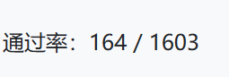

# Cryptography
南开大学2023-2024FALL密码学课程代码。由于今年换成苏老师讲课了，也换了一本更难更“数学”的教材~~懂的都懂~~，往年的祖传代码除了`AES`都没太大的借鉴意义，实验代码基本都是手搓的，需要到 OJ 上测试通过，**学弟学妹参考请给star**

**实验内容：**
1. `SPN` 网络加密以及利用大量明密文对，用线性攻击的方法分析第五轮密钥
2. `AES` 加密
3. `Zp` 上求逆元
4. `Miller-Rabin` 算法实现素性检测。
5. `ECC` 上的点乘运算

**总的来说前两次实验显得更复杂一些，但 OJ 上测试问题不会太大；后三次看起来比较简单，但不知道用的什么牛马用例，有一些死活过不了，不多说了看图（截自实验五ddl前一天）**

